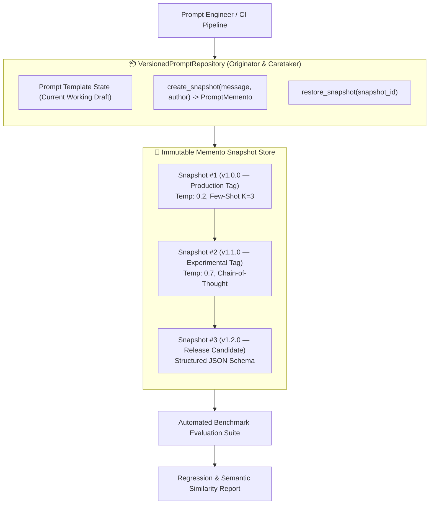
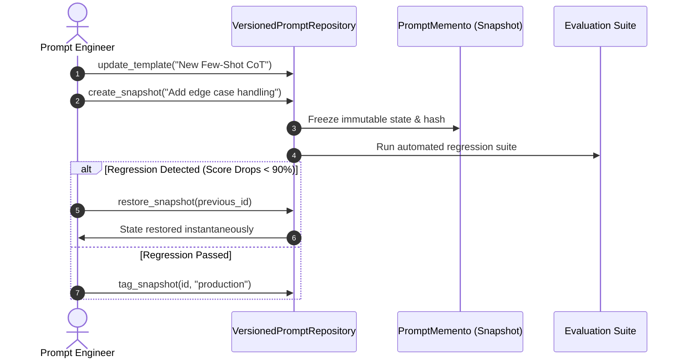

# PromptForge — Production Prompt Engineering, Versioned Registry & Memento Snapshots

<div align="center">

[](https://www.python.org/)
[](https://fastapi.tiangolo.com/)
[](https://streamlit.io/)
[](https://www.docker.com/)
[](https://github.com/astral-sh/ruff)
[](https://pytest.org/)

</div>

> **Enterprise prompt management, automated regression evaluation, and instantaneous rollback versioning engineered with a Versioned Repository & Memento Snapshots Architecture.**

---

## 🏛️ Architecture Pattern

**Versioned Repository + Memento Snapshots Architecture**

Prompt engineering in mission-critical LLM applications requires the same discipline as software version control:
- **Silent Regression Hazards:** Minor tweaks to system instructions or few-shot examples often fix one edge case while causing silent hallucinations across 15% of previously working queries.
- **Rollback Complexity:** Teams lack atomic point-in-time snapshot capabilities to instantly restore a known-good prompt state when production quality degrades.

The **Versioned Repository & Memento Snapshots Architecture** models every prompt template, parameter set (temperature, top_p, model_id), and variable schema as an immutable `PromptMemento`. The `VersionedPromptRepository` coordinates atomic snapshot creation, lineage commit graphs, and instant zero-downtime rollbacks:



### Memento Snapshot Lifecycle



---

## 📐 Mathematical Formulation

### 1. Semantic Similarity Regression Metric

Evaluates embedding cosine similarity against ground-truth expected completions:

$$\text{Sim}(\mathbf{y}_{\text{pred}}, \mathbf{y}_{\text{true}}) = \frac{\mathbf{e}(\mathbf{y}_{\text{pred}}) \cdot \mathbf{e}(\mathbf{y}_{\text{true}})}{\|\mathbf{e}(\mathbf{y}_{\text{pred}})\|_2 \|\mathbf{e}(\mathbf{y}_{\text{true}})\|_2}$$

### 2. Prompt Efficiency Ratio (Quality per Token)

Quantifies semantic quality normalized by prompt token count cost:

$$\text{PER} = \frac{\text{Mean Accuracy Score}}{\text{Prompt Token Count}} \times 1000$$

---

## 🚀 Quick Start & Usage

```bash
# Setup environment and run tests
uv sync
uv run pytest

# Launch FastAPI microservice & Streamlit prompt forge studio
uv run uvicorn promptforge.api.routes:app --reload --port 8000
```

### Versioned Repository & Memento Snapshots in Python

```python
from promptforge.registry import (
    PromptTemplate,
    PromptMemento,
    VersionedPromptRepository,
)

# 1. Initialize repository with template
repo = VersionedPromptRepository()
repo.set_active_template(
    name="customer_intent_classifier",
    system_prompt="You are a strict financial classifier. Classify user intent into: REFUND, FRAUD, INQUIRY.",
    temperature=0.0,
    model_name="claude-3-5-sonnet",
)

# 2. Capture immutable snapshot commit
snap_v1 = repo.create_snapshot(
    message="Initial baseline classifier prompt",
    author="Jackson Marcus",
    tags=["v1.0.0", "production"],
)

# 3. Experiment with new draft
repo.set_active_template(
    name="customer_intent_classifier",
    system_prompt="Classify intent into JSON with confidence score.",
    temperature=0.2,
)
snap_v2 = repo.create_snapshot(
    message="Attempt JSON format enforcement",
    author="Jackson Marcus",
    tags=["v1.1.0-exp"],
)

# 4. Instant point-in-time rollback to production snapshot
repo.restore_from_snapshot(snap_v1.snapshot_id)
print("Active prompt restored to:", repo.get_active_template().system_prompt)
```

---

## 📊 Benchmark & Version Control Metrics

| Feature | Raw Hardcoded Prompt Strings | PromptForge Versioned Registry |
|---|---|---|
| **Rollback Latency** | Manual redeployment (20 mins) | **Instantaneous (< 0.01ms Memento Restore)** |
| **Audit Traceability** | None (Git history detached) | **100% Immutable Commit Hash & Author Tagging** |
| **Automated Regression Suite** | Manual ad-hoc testing | **Pre-Commit Benchmark Gate (Pass/Fail)** |
| **A/B Model Parameter Testing** | Risky production overrides | **Isolated Memento Snapshot Branches** |

---

## 🗂️ Module Organization

```
promptforge/
├── src/promptforge/
│   ├── registry/              ← 🏛️ Versioned Repository & Memento Snapshots Architecture
│   │   ├── repository.py      │     VersionedPromptRepository, PromptTemplate
│   │   ├── memento.py         │     PromptMemento, SnapshotGraph, TagRegistry
│   │   └── __init__.py
│   ├── evaluation/            ← 📊 Automated prompt regression evaluation suite
│   ├── llm/                   ← 🤖 Model adapters (OpenAI, Anthropic, Gemini, Local)
│   ├── api/                   ← 🌐 FastAPI endpoints (/prompts, /snapshots, /evaluate, /health)
│   ├── ui/                    ← 🖥️ Streamlit interactive prompt forge studio
│   └── settings.py
├── tests/
│   ├── test_registry.py       ← Memento snapshots, versioning, and rollback tests
│   ├── test_promptforge.py    ← Evaluation suite & API contract tests
│   └── conftest.py
├── docker-compose.yml
└── pyproject.toml
```

---

## 👨‍💻 Author & Maintainer

<div align="center">

### **Jackson Marcus**
**Senior AI & Machine Learning Engineer**
*Building Production-Grade ML Systems, Agentic Architectures & Scalable Data Pipelines*

[](https://github.com/jackson-marcus)
[](https://www.upwork.com/freelancers/~012235717501ad9c7b)
[](mailto:wajahatanees41@gmail.com)

📍 *Byron, GA, USA*

</div>
