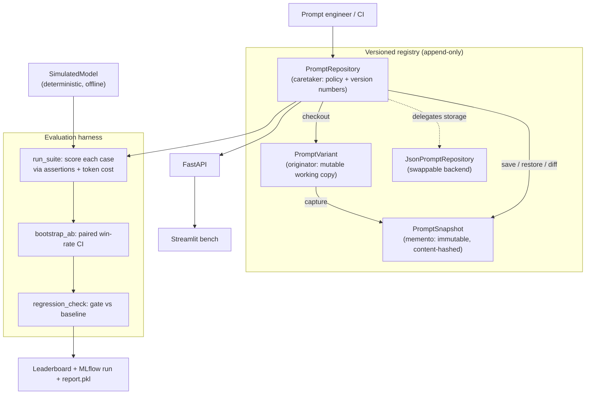

<div align="center">


</div>

# PromptForge — a versioned prompt registry with A/B evaluation

**Treat prompts like code you can version, test, and roll back.** PromptForge keeps every prompt variant as an immutable, append-only snapshot, scores each one against a task test-suite of assertion-checked cases, and compares variants with a paired-bootstrap win-rate — so "the new prompt is better" is a measured claim with a confidence interval, not a hunch.

<div align="center">

[](https://www.python.org/)
[](https://fastapi.tiangolo.com/)
[](https://pytest.org/)
[](https://opensource.org/licenses/MIT)

</div>

---

## The problem

Prompt changes are deceptively risky. A small edit to a system instruction can fix one edge case and quietly break others, and there is usually no record of *which* wording shipped, *who* changed it, or how to get the previous one back. Prompts live as string literals scattered through application code, so there is nothing to diff, nothing to test against, and no clean rollback.

PromptForge gives prompts the same discipline software already has: an append-only version history per variant, a test-suite that scores each version, an A/B comparison that says whether a change is a real improvement or noise, and a one-call restore that brings an old version back **without** rewriting history.

## What it does

- **Versions prompts** as immutable, content-addressed snapshots — identical text is never stored twice, and a stale save is rejected instead of clobbering someone else's version.
- **Scores prompts** by running a task's cases through a model and checking each output with an assertion (`exact_match`, `contains`, `is_json`, `regex`).
- **Compares variants** with a paired bootstrap: the pass-rate difference plus a 95% confidence interval, so "B beats A" only counts when the interval clears zero.
- **Gates regressions**: a candidate that drops more than the configured tolerance below the registered baseline fails the gate.
- **Accounts for cost**: input/output tokens are priced per the config, so quality is always weighed against spend.

## How it works

The registry is built on the **Memento pattern** with a swappable storage backend, and the evaluation harness is a separate, pure layer that reads snapshots and scores them.



### The versioning model (Memento / Caretaker)

Three roles, each with one job:

- **`PromptSnapshot`** (memento) — a frozen, content-addressed value object recording one state of one variant. It validates its own `content_hash` on construction, so a snapshot can never claim to be a template it isn't, whether just captured or read back off disk.
- **`PromptVariant`** (originator) — the mutable working copy you edit. `capture()` freezes it into the next snapshot; `restore()` rolls it back to an earlier one while remembering that earlier version as the lineage parent.
- **`PromptRepository`** (caretaker) — owns the *policy*: version numbering, the content-addressed no-op, optimistic-concurrency conflict detection, restore-as-append, and diffing. It delegates only four raw storage primitives to a backend, so `JsonPromptRepository` could be swapped for Postgres or S3 without touching the policy.

The store is **append-only by construction** — there is no update and no delete. Restoring an old version appends a *new* head whose parent is the restored version, so "we shipped v2, rolled back to v1, then shipped v4" stays legible months later.

### The evaluation methodology

A task is a set of labeled cases, each with an `expected` value and an assertion. `run_suite` renders each case's input into the template, runs the model, and scores the output, producing a pass rate and a token-cost total.

To decide whether one variant genuinely beats another, the harness uses a **paired bootstrap** over the shared cases. For each of `iters` resamples it draws case indices with replacement and records the pass-rate difference $B - A$ on that resample; the 2.5th and 97.5th percentiles of those differences form the 95% CI:

$$\Delta = \overline{B} - \overline{A}, \qquad \text{CI}_{95\%} = \left[\, Q_{0.025}(\Delta^*),\; Q_{0.975}(\Delta^*) \,\right]$$

`B` is declared a significant winner only when the whole interval sits above zero. The **regression gate** compares a candidate's pass rate against the registered baseline and fails if the drop exceeds the tolerance (default `0.03`, i.e. 3 percentage points).

### The model is a simulator, on purpose

`SimulatedModel` is deterministic and fully offline — a real LLM would add nondeterminism and network cost the workbench doesn't need to demonstrate the *harness*. Output quality is a function of measurable prompt-engineering features (a format spec, few-shot examples, explicit constraints), so a better-engineered prompt earns a higher pass rate that the A/B machinery then recovers. The signal is planted; the code that measures it is the real deliverable.

## Getting started

```bash
make install                 # uv sync --group dev

uv run python scripts/make_tasks.py           # build synthetic cases + seed prompt variants
uv run python -m promptforge.evaluation.run   # evaluate variants -> report.pkl + MLflow run

make test                    # run the suite (uv run pytest --cov)
```

Run the services:

```bash
make api                     # FastAPI on http://localhost:8460
make ui                      # Streamlit bench on http://localhost:8961
make mlflow                  # MLflow tracking UI on http://localhost:5047
```

The API needs `report.pkl` and `cases.parquet` to exist, so run the two data-pipeline commands above before starting it. Or run everything in containers:

```bash
make docker-up               # docker compose up --build -d  (API :8460, UI :8961)
make docker-down
```

### Use the registry directly

```python
from promptforge.registry.repository import get_repository

repo = get_repository()

# Register a first version (append-only; parent is None, version becomes 1)
repo.register("sentiment", "engineered",
              "Classify the sentiment. Answer with only one word: {input}",
              created_by="jackson")

# Edit and save a new version
repo.register("sentiment", "engineered",
              "Classify the sentiment. Do not explain. Answer with only one word: {input}",
              created_by="jackson")

# Roll back to v1 — appends a NEW head whose parent is v1; history is kept
head = repo.restore("sentiment", "engineered", version=1)
```

## API

| Method | Route | Purpose |
|---|---|---|
| `GET`  | `/health` | Liveness check |
| `GET`  | `/tasks` | Tasks with their baseline variant and variant count |
| `GET`  | `/leaderboard/{task}` | Ranked variants: pass rate, cost, delta vs baseline, CI, gate |
| `POST` | `/ab` | A/B two ad-hoc templates on a task's cases (bootstrap CI + regression) |
| `POST` | `/optimize` | Hill-climb a better template for a task under a model-call budget |
| `GET`  | `/variants/{task}` | Current head template of every registered variant |
| `GET`  | `/variants/{task}/history` | Full append-only lineage of every snapshot |
| `GET`  | `/variants/{task}/diff` | Unified line diff between two versions of a variant |
| `POST` | `/variants/{task}/restore` | Restore a version by appending it as a new head |

## Evaluation

Evaluation runs on **synthetic** data. `scripts/make_tasks.py` generates two tasks (`sentiment`, `intent`), each with labeled cases (60 per task by default) checked via `exact_match`, and seeds three prompt variants of increasing quality: `bare` (no format spec or examples), `formatted` (adds a format instruction), and `engineered` (format + few-shot + constraint).

`promptforge.evaluation.run` scores the head of every variant, builds a per-task leaderboard, logs pass-rate metrics and run params to MLflow, and writes `report.pkl` for the API. Because the simulator's quality tracks prompt-engineering features, the engineered variant is expected to lead the board — but the *ranking is measured by the harness, not asserted*. No fixed numbers are quoted here because they depend on the generated dataset and seed; reproduce them with:

```bash
uv run python scripts/make_tasks.py
uv run python -m promptforge.evaluation.run
```

## Testing

```bash
make test                    # uv run pytest --cov
```

- `test_registry.py` — memento immutability, content addressing, the stale-save conflict, restore-as-append, and diffing.
- `test_promptforge.py` — prompt-feature detection, assertion scorers, the bootstrap A/B, the regression gate, and the API contract.

## Searching for a better prompt, on a budget

The leaderboard ranks variants somebody already wrote. `POST /optimize` writes
them: a hill climb that proposes one edit at a time (add a format spec, add a
constraint, add few-shot examples, rewrite the persona), scores it against the
current best, and keeps it only if an acceptance rule says the gain is real.

Two things make that non-trivial, and both are in `optimizer/`:

- **`ledger.py`** — every candidate costs model calls, so the climb runs against
  a declared budget and raises `BudgetExhaustedError` rather than quietly
  spending more. The run reports calls and dollars alongside the result.
- **`climb.py`** — the acceptance rule is a parameter, not a constant:
  `greedy` (any positive delta), `safe` (positive, and the CI lower bound is not
  worse than a tolerance), `gated` (the A/B must be significant).

### The strict rules were worse, which is not what I expected

`scripts/bench_optimizer.py` scores the rules against the simulator's planted
signal. The simulator rewards exactly three prompt features and is indifferent
to the persona line, so the *true* pass rate of any template is computable — and
every rule can be scored on what actually matters rather than on its own report.

Bootstrap CI over rows (4 seeds, 2 tasks):

```
  policy   inert  missed    true     dev    test  optimism   calls
  greedy    0.12    0.25   0.840   0.929   0.917     0.013     322
    safe    0.12    0.88   0.725   0.850   0.854    -0.004     296
   gated    0.00    1.12   0.685   0.821   0.812     0.008     285
```

`gated` is the most disciplined rule by its own lights — it accepted **zero**
inert edits, perfect precision. It also finished with the worst prompt. It threw
away 1.12 of the three real improvements per run on average, ending at a true
pass rate of 0.685 against greedy's 0.840.

The reason the caution does not pay here is in the `optimism` column: greedy's
dev score overshoots its held-out score by 0.013. There is barely any
overfitting for a significance gate to protect against, so the gate is almost
pure cost.

Resampling *inputs* rather than rows widens the intervals (each input repeats
about four times in a suite, so rows are not independent) and makes the strict
rules stricter still:

```
  policy   inert  missed    true   optimism
  greedy    0.12    0.25   0.840      0.013
    safe    0.12    1.12   0.685     -0.042
   gated    0.00    1.38   0.645     -0.029
```

Read this as a statement about *this simulator at this suite size*, not a
general result. With a noisier task, a smaller dev set, or edits that genuinely
overfit, the ordering would be expected to flip — which is exactly why the rule
is a parameter and the benchmark is committed.

```bash
uv run python scripts/bench_optimizer.py --seeds 1 2 3 4
uv run python scripts/bench_optimizer.py --seeds 1 2 3 4 --cluster
```

## Limitations

- The optimiser is judged here against a simulator whose rewarded features are known. On a real model the true pass rate is unobservable, so the acceptance rule cannot be tuned this way - the benchmark shows the rules behave sanely, not which one to pick.
- The edit set is four hand-written operators. It cannot discover phrasing a human did not think to encode.
- Budget is counted in model calls, not tokens or wall clock; a long-context task would exhaust real spend well before the call ceiling.

- The model is a deterministic **simulator**; results demonstrate the harness, not real LLM behaviour. Swapping in a live model would require an adapter and would reintroduce nondeterminism and cost.
- Assertion scoring is intentionally simple (exact/substring/JSON-validity/regex); nuanced or open-ended outputs would need semantic or judge-based scoring.
- The default backend is a single JSON file read once per instance — fine for a workbench, not for concurrent multi-writer use (the swappable-backend seam exists precisely so this can change).
- The bootstrap CI assumes the two variants are evaluated on the *same* cases; A/B across mismatched suites is out of scope.

## Project structure

```
src/promptforge/
├── registry/     # Memento + originator + caretaker; the versioning core
│   ├── memento.py     # PromptSnapshot (immutable) + PromptVariant (working copy)
│   └── repository.py  # PromptRepository policy + JsonPromptRepository backend
├── evaluation/   # run_suite, bootstrap A/B, regression gate, cost (harness.py)
├── llm/          # SimulatedModel — deterministic, feature-aware, offline
├── api/          # FastAPI app (main:app) and routes
├── ui/           # Streamlit bench: leaderboards, A/B, history/diff
└── settings.py   # env + configs/config.yaml loader
scripts/make_tasks.py   # synthetic task cases + seed prompt variants
```

## License

MIT

---

<div align="center">

**Jackson Marcus** · Senior AI & Machine Learning Engineer

[](https://github.com/jackson-marcus)
[](mailto:wajahatanees41@gmail.com)

</div>
