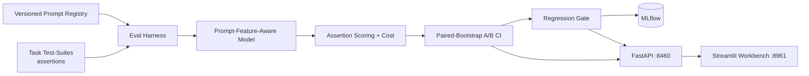

# PromptForge — Prompt Engineering Workbench & Evaluation Harness

<div align="center">

[](https://www.python.org/)
[](https://fastapi.tiangolo.com/)
[](https://streamlit.io/)
[](https://mlflow.org/)
[](https://www.docker.com/)
[](https://github.com/astral-sh/ruff)
[](https://pytest.org/)
[](https://opensource.org/licenses/MIT)

</div>

> **Treat prompts like code: a versioned prompt registry, task test-suites with assertion-based scoring, A/B evaluation across variants with a paired-bootstrap win-rate CI, a regression gate, and per-run token-cost accounting.**

---

## 📖 Executive Summary & Value Proposition

**`promptforge`** is a production-grade, end-to-end machine learning system built with strict engineering discipline, reproducible pipelines, and enterprise MLOps best practices. It bridges the gap between theoretical statistical rigor and high-availability operational microservices.

## 🛠️ Core Methodologies & Prompt Ops

### 1. The Harness Is the Product
- A deterministic, **prompt-quality-aware simulated model** stands in for a live LLM (offline, reproducible, zero cost) — its output correctness and formatting depend on measurable prompt features (format spec, few-shot examples, explicit constraints). The evaluation machinery around it — assertions, bootstrap CIs, regression gate, cost — is real production code.

### 2. Assertion-Based Scoring & Versioned Registry
- Four assertion types (exact match, contains, is-JSON, regex); prompts registered per task with versioning and a designated baseline.

### 3. A/B Evaluation With a Paired-Bootstrap CI
- Two variants run over the shared case set; the pass-rate difference gets a 2,000-iteration paired bootstrap 95% CI. "Beats baseline" means the CI clears zero — not a single lucky run.

### 4. The Recovered Lesson (proven, not asserted)
Across both task suites, the harness recovers the prompt-engineering ladder under strict exact-match scoring:

| Variant | sentiment | intent |
|---|---|---|
| bare (no format instruction) | 0% | 0% |
| formatted (adds format spec) | 60% | 67% |
| **engineered (format + few-shot + constraint)** | **83%** | **100%** |

A bare prompt scores 0% because its answers arrive wrapped in prose ("The answer is positive.") and fail exact match — the single most common real-world prompt bug, made measurable. Longer prompts cost more tokens; the workbench prices that too.

## 📊 Architecture & Pipeline



## 🛠️ Tech Stack & Engineering Standards
- **Core Engine:** Python 3.12, NumPy, Pandas — hand-rolled bootstrap and scoring
- **Serving & UI:** FastAPI, Streamlit A/B bench, MLflow
- **Testing:** Pytest verification of feature detection, assertions, engineered-beats-bare, bootstrap significance, regression gating, and variant-ranking recovery


---

## 🚀 Quickstart & Setup Guide

### 1. Prerequisites & Environment Setup
Using **[uv](https://docs.astral.sh/uv/)** for lightning-fast, reproducible dependency resolution:

```bash
# Clone the repository
git clone https://github.com/jackson-marcus/promptforge.git
cd promptforge

# Install dependencies and pre-commit hooks
uv sync --group dev
```

### 2. Build Tasks & Evaluate
```bash
# Create the task suites + register seed prompt variants
uv run python scripts/make_tasks.py

# Evaluate all variants, A/B vs baseline, regression + cost; logs to MLflow
uv run python -m promptforge.evaluation.run
```

### 3. Run Test Suite & Code Quality Checks
```bash
# Run unit & integration tests with coverage
uv run pytest --cov

# Run ruff linter and formatting checks
uv run ruff check .
uv run ruff format --check .
```

### 4. Launch Services Locally
```bash
# Start FastAPI REST API (listening on port :8460)
make api
# Or: uv run uvicorn promptforge.api.main:app --reload --port 8460

# Start interactive Streamlit dashboard (listening on port :8961)
make ui

# Launch local MLflow Experiment Tracking UI (listening on port :5047)
make mlflow
```

### 5. Run with Docker Compose
```bash
# Spin up the complete microservice stack
docker compose up --build
```

---

## 📂 Repository Layout

```
promptforge/
├── .github/workflows/ci.yml       # GitHub Actions CI pipeline (lint, test, build)
├── configs/                      # Eval, bootstrap, and cost configuration
├── data/                         # Task cases + registry + eval report
├── scripts/                      # make_tasks.py suites + seed variants
├── src/promptforge/              # Core Python package
│   ├── api/                      # FastAPI routes: /tasks /leaderboard /ab /variants
│   ├── evaluation/               # Assertions, harness, bootstrap, run
│   ├── llm/                      # Prompt-feature-aware simulated model
│   ├── registry/                 # Versioned prompt registry
│   ├── ui/                       # Streamlit workbench application
│   └── settings.py               # Centralized configuration & environment loader
├── tests/                        # Comprehensive Pytest suite
├── docker-compose.yml            # Multi-service container orchestration
├── Dockerfile                    # Container definition for API service
├── Makefile                      # Standardized project tasks
└── pyproject.toml                # Pinned dependencies and tool configs
```

---

## 👤 Author & Contact

**Jackson Marcus**
- **Email:** [jackson.marcus.work@gmail.com](mailto:jackson.marcus.work@gmail.com)
- **Upwork:** [Jackson Marcus on Upwork](https://www.upwork.com/freelancers/~012235717501ad9c7b)
- **GitHub:** [@jackson-marcus](https://github.com/jackson-marcus)

*Available for machine learning engineering, MLOps, data science, and AI system architecture consulting and contract engagements.*
